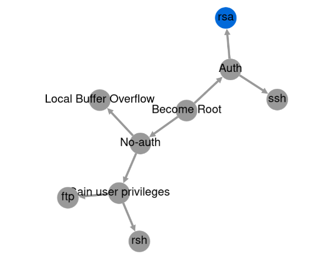

# Graph Line

Uses [Cytoscape.js](https://js.cytoscape.org/) to create simple graphs.

**Usage**

1. Add a node by click anywhere on the page. You'll be prompted to add a label. 
2. Add edges by selecting a node (source) then select another (or same) node for the target.

**Figure 1**:  Screen shot of an example graph, using the Compound Spring Embedder (COSE) layout. 

## Development

You can open the `index.html` file in your web browser and it will work. Or you can use [reload](https://www.npmjs.com/package/reload) to run a local webserver and automatically refresh the page on changes. 

	npm install reload
	./node_modules/reload/bin/reload -b

## Code License

Copyright (c) 2023 Dr. Peter Maynard

Permission is hereby granted, free of charge, to any  person obtaining a copy of this software and associated documentation  files (the "Software"), to deal in the Software without restriction,  including without limitation the rights to use, copy, modify, merge,  publish, distribute, sublicense, and/or sell copies of the Software, and to permit persons to whom the Software is furnished to do so, subject  to the following conditions:

The above copyright notice and this permission notice shall be included in all copies or substantial portions of the Software.

THE SOFTWARE IS PROVIDED "AS IS", WITHOUT WARRANTY OF ANY  KIND, EXPRESS OR IMPLIED, INCLUDING BUT NOT LIMITED TO THE WARRANTIES OF MERCHANTABILITY, FITNESS FOR A PARTICULAR PURPOSE AND NONINFRINGEMENT.  IN NO EVENT SHALL THE AUTHORS OR COPYRIGHT HOLDERS BE LIABLE FOR ANY  CLAIM, DAMAGES OR OTHER LIABILITY, WHETHER IN AN ACTION OF CONTRACT,  TORT OR OTHERWISE, ARISING FROM, OUT OF OR IN CONNECTION WITH THE  SOFTWARE OR THE USE OR OTHER DEALINGS IN THE SOFTWARE./
